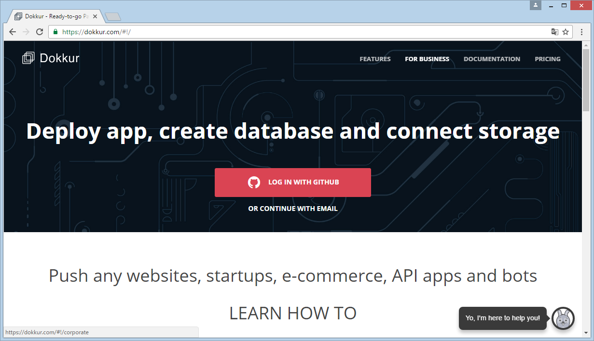
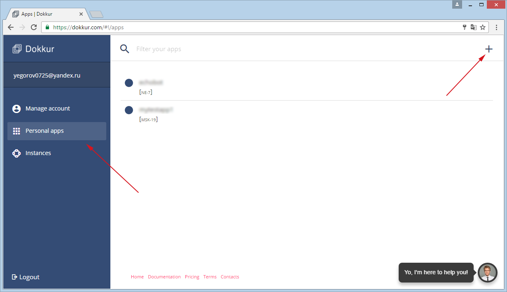
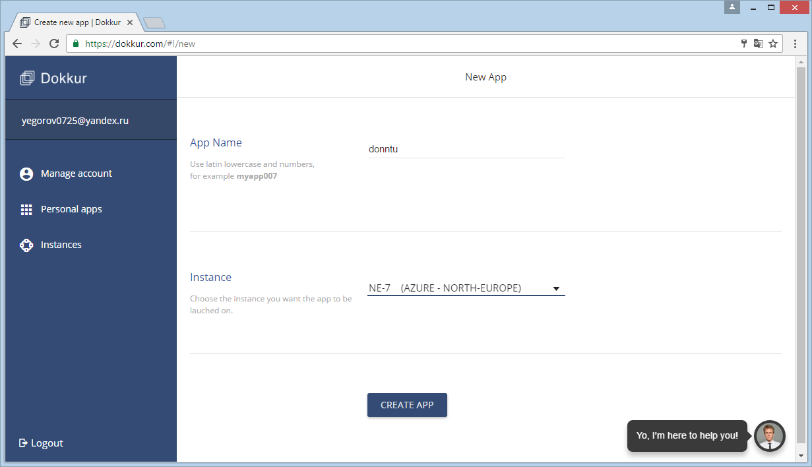
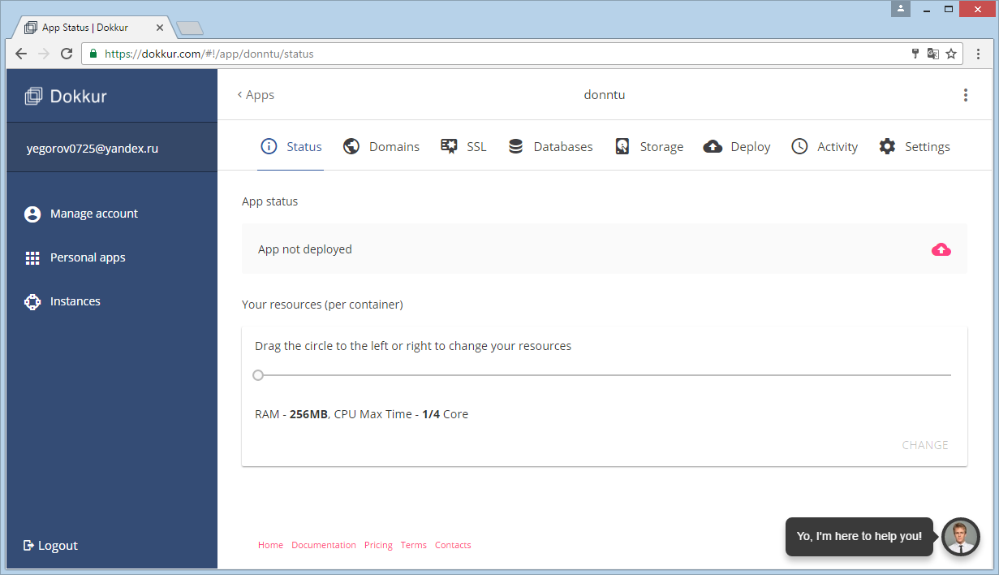
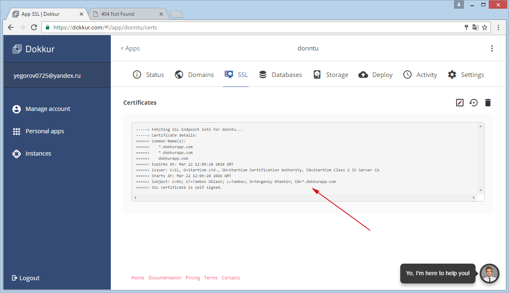
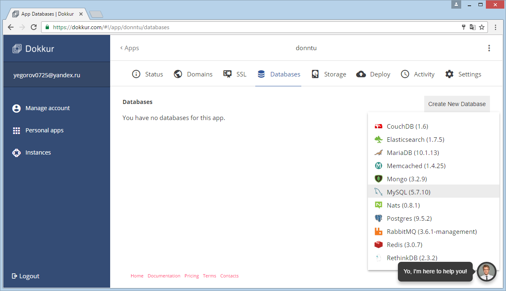
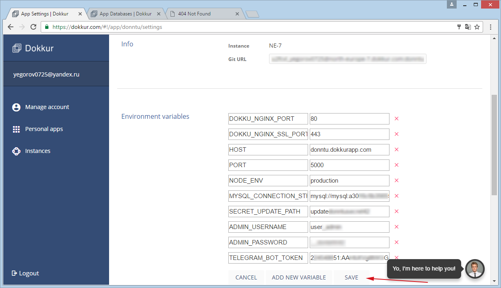

Развертывание приложения в Dokkur
=================================

## Переходим по адресу [`https://dokkur.com`](https://dokkur.com)



## Переходим в раздел `Personal apps` и создаем новое приложение



## Вводим название приложения и выбираем `Instance` на котором будет развернуто приложение, нажимаем на кнопку `CREATE APP`





## Переходим во вкладку SSL

По умолчанию нет никакого сертификата (впринципе сайт будет работать по HTTP, 
но бот Telegram принимает запросы только по HTTPS). Или сбрасываем сертификат 
по умолчанию, или переходим по адресу: `https://youapp.dokkurapp.com`,
результат должен получится как на 2-ом изображении.




## На вкладке `Databases` создаем новую БД и привязываем ее к приложению




## Переходи на вкладку `Settings`, запоминаем `Git URL` и вводим переменные окружения




## Открываем консоль, клонируем репозиторий, заходим в корневой каталог и добавляем удаленный репозиторий (`Git URL`) в git

```
$ git clone https://github.com/Yegorov/donntu-telegram.git
$ cd donntu-telegram
$ git remote add dokkur GIT_URL
```

## Отправляем на сервер Dokkur это приложение

```
$ git push dokkur master
// Ход развертывания приложения
```
